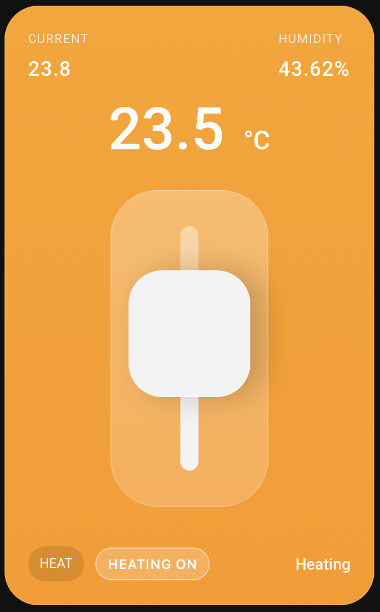
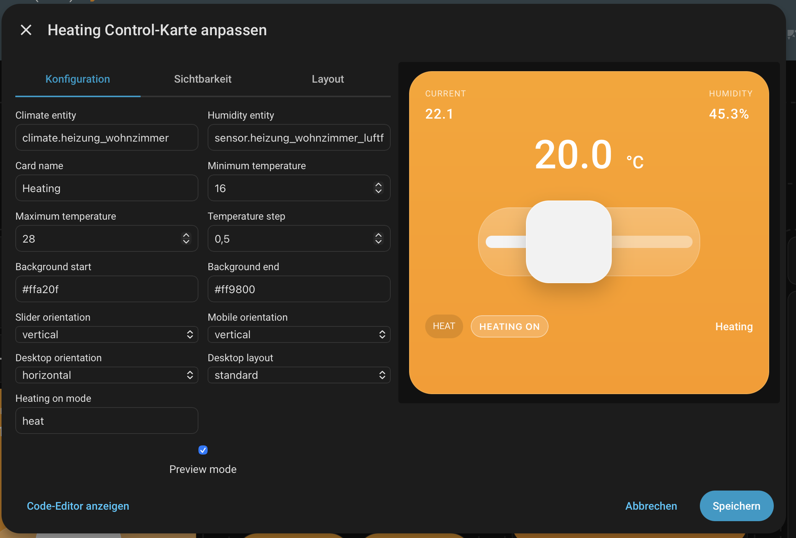

# Home Assistant Heating Control Card

A custom **Lovelace dashboard card** for Home Assistant inspired by the orange thermostat design in your reference image.



## Languages

- 🇬🇧 English (default): `README.md`
- 🇩🇪 Deutsch: [`README.de.md`](README.de.md)
- 🇫🇷 Français: [`README.fr.md`](README.fr.md)
- 🇪🇸 Español: [`README.es.md`](README.es.md)
- 🇮🇹 Italiano: [`README.it.md`](README.it.md)
- 🇵🇱 Polski: [`README.pl.md`](README.pl.md)
- 🇳🇱 Nederlands: [`README.nl.md`](README.nl.md)
- 🇨🇿 Čeština: [`README.cs.md`](README.cs.md)

## What this card does

- Shows **current temperature** from your `climate` entity.
- Shows **target temperature** and lets you change it using a slider.
- Lets you toggle heating **on/off** directly from the card.
- Shows optional **humidity** from a separate sensor.
- Shows current HVAC state (`heat`, `idle`, etc.).
- Shows a preview state in the dashboard card picker.
- Calls Home Assistant service `climate.set_temperature`.
- Calls Home Assistant service `climate.set_hvac_mode` when heating is toggled.

---

## Install with HACS (recommended)

### 1) Add this repository as a custom repository

1. Open **HACS** in Home Assistant.
2. Go to **Settings** (top-right menu).
3. Open **Custom repositories**.
4. Add this repository URL.
5. Select category: **Dashboard**.
6. Save.

### 2) Install the card

1. In HACS, open **Dashboard**.
2. Search for **Home Assistant Heating Control Card**.
3. Click **Download**.
4. Restart Home Assistant (recommended after first install).

### 3) Add the resource (if HACS does not add it automatically)

Go to **Settings → Dashboards → Resources** and add:

- **URL**: `/hacsfiles/ha-heat-design/heating-control-card.js`
- **Type**: `JavaScript Module`

> If your repository slug differs, adjust the path accordingly.

> Legacy path support: if you already use `/hacsfiles/ha-heat-design/ha-heat-design.js`, it now acts as a compatibility loader and still works.

## Manual installation (alternative)

1. Copy `heating-control-card.js` to `/config/www/` (or both files if you want backward compatibility with old resource paths).
2. Add this resource:
   - URL: `/local/heating-control-card.js`
   - Type: `JavaScript Module`

---

## Usage in dashboard YAML

```yaml
type: custom:heating-control-card
name: Living Room
entity: climate.living_room
humidity_entity: sensor.living_room_humidity
min_temp: 16
max_temp: 28
step: 0.5
background_start: "#ffa20f"
background_end: "#ff9800"
slider_orientation: vertical
slider_orientation_mobile: vertical
slider_orientation_desktop: horizontal
desktop_layout: compact
heating_on_mode: heat
```

## Configure with the UI editor

You can now configure the card directly in the Home Assistant **UI editor** (no manual YAML required for most options).



### Card options

| Option | Required | Default | Description |
|---|---|---:|---|
| `type` | yes | - | Must be `custom:heating-control-card` |
| `entity` | yes | - | Climate entity, e.g. `climate.living_room` |
| `name` | no | `Heater` | Label shown in the footer |
| `humidity_entity` | no | - | Sensor entity for humidity |
| `min_temp` | no | `16` | Minimum slider value |
| `max_temp` | no | `28` | Maximum slider value |
| `step` | no | `0.5` | Slider increment |
| `background_start` | no | `#ffa20f` | Top gradient color (also used as solid background color fallback) |
| `background_end` | no | `#ff9800` | Bottom gradient color |
| `slider_orientation` | no | `vertical` | Slider direction: `vertical` or `horizontal` |
| `slider_orientation_mobile` | no | - | Mobile-only slider orientation override (`vertical` or `horizontal`) |
| `slider_orientation_desktop` | no | - | Desktop-only slider orientation override (`vertical` or `horizontal`) |
| `desktop_layout` | no | `standard` | Desktop layout density: `standard` or `compact` |
| `heating_on_mode` | no | `heat` | HVAC mode used when toggling from OFF to ON (must be supported by your climate entity) |

---

## Notes

- This is a Lovelace **frontend card** (Dashboard category in HACS).
- `entity` must point to a valid `climate` entity.
- If `humidity_entity` is missing or unavailable, humidity is shown as `--`.
- `slider_orientation_mobile` and `slider_orientation_desktop` override `slider_orientation` depending on the current viewport width.
- `desktop_layout: compact` only affects desktop view and keeps the mobile layout unchanged.

---

## Quick start

1. Install with HACS (Dashboard category).
2. Add resource (if needed): `/hacsfiles/ha-heat-design/heating-control-card.js`
3. Add card:

```yaml
type: custom:heating-control-card
entity: climate.living_room
name: Living Room
```

## Localization

The card UI and the visual editor now automatically support:
English, German, French, Spanish, Italian, Polish, Dutch, and Czech.

---

## More projects

- Looking for the matching dashboard design for climate/heating controls? Check out my other project:  
  **ha-button-design** → https://github.com/404GamerNotFound/ha-button-design

## Support me

- If you like this project and want to support my work, you can donate here:  
  **PayPal** → https://www.paypal.com/paypalme/TonyBrueser
